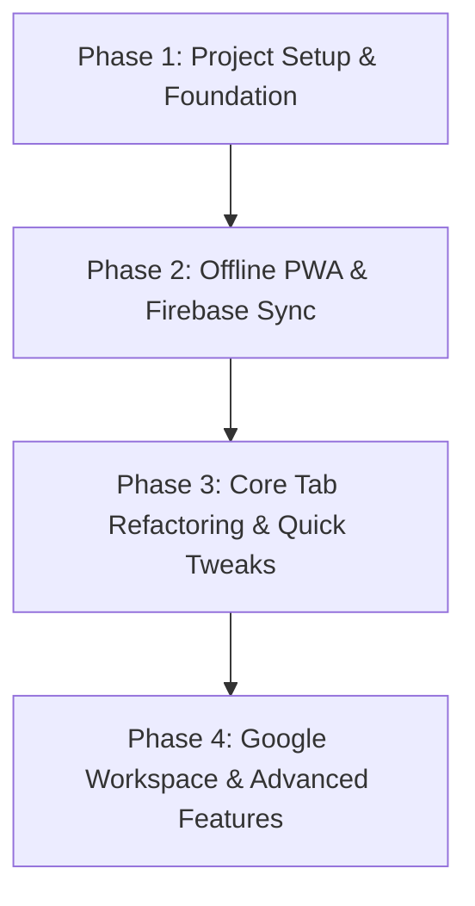

# Kawaii Launchpad - PWA & Multi-Device Sync Architecture Plan

Transform the **Kawaii Launchpad** into a Progressive Web App (PWA) featuring automatic real-time synchronization between your **Pixel 10 Pro XL** and web browsers, complete Google Workspace integration, and a modular foundation for all your custom productivity tools.

---

## 🎨 App Branding & Assets

- **App Name**: **Kawaii Launchpad**
- **App Icon**: Mint-green neobrutalist heart (`media__1786405184811.png`)
- **PWA Icons Generated**:
  - `favicon.ico` (32x32)
  - `pwa-192x192.png` (Android home screen icon)
  - `pwa-512x512.png` (High-DPI splash screen icon)
  - `maskable-icon.png` (Adaptive Android icon container)

---

## 💡 Tech Stack Explanation & Why It Fits Your Vision

| Technology | What It Does | Why It Fits Your Requirements |
| :--- | :--- | :--- |
| **Vite** | Blazing-fast build tool & dev server | Gives instantaneous reloads and builds a lightweight PWA bundle optimized for Android performance. |
| **React + TypeScript** | Component framework with strict typing | **Crucial for your features**: React keeps state synced across components (e.g., your App-Wide Pomodoro Timer running while navigating tabs, or active task updating in the header). TypeScript ensures task/goal data structures remain bug-free. |
| **Tailwind CSS + Neobrutalism** | Utility CSS + Custom design system | Retains your exact pastel palette (`#B5D2E8`, `#C2E2C8`, `#FDF0C3`, `#F6C8D1`, `#D5C9E5`), bold 2px/6px clicky borders, and responsive layouts for Pixel 10 Pro XL. |
| **Firebase Cloud Firestore** | Offline-First Real-Time Cloud DB | Changes made on your Pixel 10 Pro XL while offline save instantly to local storage and auto-sync with your web browser the moment you're back online. |
| **Google Auth & APIs** | Single Sign-On & Workspace integration | Unlocks 1-click Google Sign-In across devices and direct API connections to **Google Calendar**, **Google Drive**, **Docs**, **Keep**, and **Sheets**. |
| **`vite-plugin-pwa`** | Service worker & Web Manifest generator | Enables full Android installation as a standalone app with offline asset caching and your custom mint heart icon. |

---

## ❓ Clarification Questions for Feature Customization

> [!IMPORTANT]
> Please review these brief clarification questions so we build each feature to match your exact mental model:

### 1. Header Layout & Active Task Container
- **Layout Concept**: We can place the **Digital Clock** right below `"Your daily kawaii command center"`, and add a dedicated row in the header box containing:
  - `[ 🚨 Prompt Maker ]` button
  - `[ 📌 Active: Task Name (due 2:30 PM) ]` container taking up the remaining width.
- *Does this layout feel right for your mobile screen on Pixel 10 Pro XL?*

### 2. "Tomorrow's Runway" ➔ Google Calendar Integration
- **Options**:
  - **Option A (Manual 1-Click)**: A `[ 📅 Add to Google Calendar ]` button next to Tomorrow's Runway that creates an event for 8:30 PM today (or 8:00 AM tomorrow).
  - **Option B (Automatic Sync)**: Whenever you type in Tomorrow's Runway, it automatically schedules/updates the event in your Google Calendar in the background via the Google Calendar API.
- *Which flow do you prefer?*

### 3. Eisenhower Matrix + Time Reality Check Combo
- **Concept**: Each task in the 4 matrix quadrants gets an **Estimated Time** (e.g., 30m) vs **Actual Time Spent**. A top banner calculates total Q1 (Urgent/Important) hours vs your available work hours today for a quick "Reality Check".
- *Does this match what you envisioned?*

### 4. Routine Checklists
- **Concept**: A dedicated routine manager with:
  - Search bar & tag filters (`#morning`, `#admin`, `#shutdown`).
  - Time-aware sorting: Morning routines automatically bump to the top in the AM; evening routines bump to top in the PM.
- *Would you like this as a tab in the top navigation or a slide-out modal?*

### 5. Email Sprint "Get Specific" & Reflection PDF Report
- **Get Specific**: Replaces double-click text edit with a clear `[ Get Specific ]` button next to sprint controls to assign names/labels to boxes.
- **Reflection Gate**: Clicking `[ Export PDF Report ]` triggers a quick reflection popup (energy swings, wins, hurdles, mood). Checking `[ ] Don't ask again today` bypasses this popup until midnight.
- *Does this workflow sound complete?*

### 6. Analog Pomodoro Timer
- **Concept**: A floating/header-mounted Pomodoro timer with a cute visual pastel dial ring, play/pause controls, and subtle audio chime that continues running seamlessly while you switch tabs.
- *Should this sit in the top header or as a collapsible floating widget in the bottom corner?*

---

## 🚀 Phased Implementation Strategy

### Phase 1: Foundation & Build System Setup
- Initialize Vite + React + TypeScript + Tailwind CSS project in repository root.
- Process user icon `media__1786405184811.png` to generate app favicon, 192x192, 512x512, and maskable PWA icons.
- Configure Neobrutalist CSS tokens, fonts (Nunito), and global styles.

### Phase 2: Offline PWA & Firebase Cloud Sync
- Configure `vite-plugin-pwa` with Workbox offline service worker and app manifest (`Kawaii Launchpad`).
- Setup Firebase Firestore real-time sync module with local IndexedDB persistence fallback.
- Setup Google OAuth authentication wrapper.

### Phase 3: Core UI Refactoring & Direct Tweaks
- **Header**: Digital clock, Active Task badge, Prompt Maker button ("Mad Libs" late-to-work text generator for Gordon & Kristen with 1-click copy).
- **Navigation**: Add new **`[ 🔗 Links ]`** button alongside Home, Daily, Projects, Matrix, Sprint, Transition, Assets.
- **Daily Planner**:
  - Interactive star completion buttons for Top 3 Goals (click to fill with pastel color).
  - Auto-sorting tasks & timeline by time due.
- **Projects**:
  - Add new project cards & drag-to-rearrange capability.
  - Project sub-tasks with "Carry over to Daily List" date selector (auto-adds "Work on [Project]" goal).
- **Email Sprint**:
  - Update text: `"Click a box after you send an email!"`.
  - Remove double-click text trigger; add `[ Get Specific ]` button.
  - Integrated sprint timer.

### Phase 4: Google Workspace & Advanced Productivity Tools
- **Google Calendar API**: Sync Tomorrow's Runway directly to Google Calendar.
- **Routine Checklists**: Time-aware routine lists with tag filtering & search.
- **Eisenhower Time Reality Check**: Estimated vs actual hours calculation.
- **App-Wide Pomodoro Timer**: Visual analog dial timer in header/floating bar.
- **Reflection PDF Exporter**: Stats summary with daily reflection gate & bypass toggle.
- **Assets Tab**: Sort, filter, and rearrange reference asset links (Google Drive/Docs/Sheets/Slides).

---

## 📅 Next Steps & Verification Plan

### Verification
1. **PWA & Icons**: Validate app installation on Android (Pixel 10 Pro XL simulation) with mint heart icon.
2. **Build**: Run `npm run build` to confirm clean compilation.
3. **Sync Test**: Verify real-time updates across desktop browser and mobile device.

*Once you review and confirm the clarification questions above, we will begin Phase 1 setup!*
